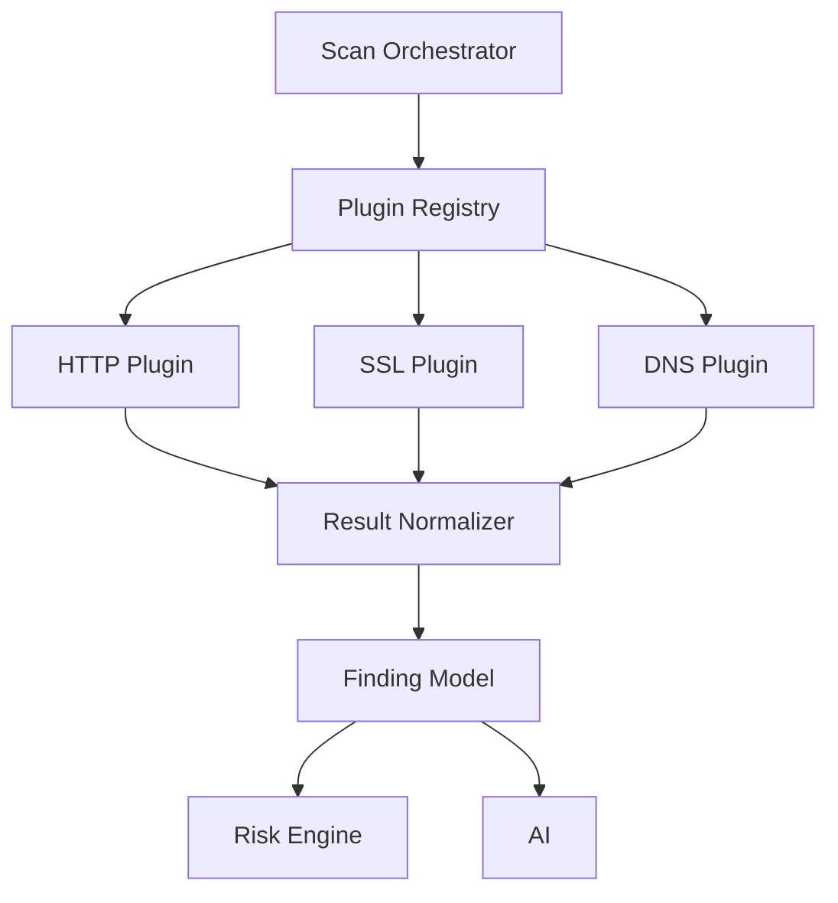

# Plugin architecture

How scanner plugins plug into the platform without owning risk, AI, or persistence. This is the engineering contract: **one input shape, one output shape, many plugins**.

Related: [scan engine](./scan-engine.md) (as-built layers), [plugin authoring](../plugins/authoring.md), [findings](../findings/README.md).

## Diagram B — Plugin Architecture

Plugins never talk to the dashboard, the risk formula, or the LLM. They return `ScanResult`. The orchestrator normalizes that into the **Finding model**. Risk and AI both read findings; only Risk **computes** the score.



```
                Scan Orchestrator
                       │
                       ▼
                Plugin Registry
                       │
       ┌───────────────┼────────────────┐
       ▼               ▼                ▼
   HTTP Plugin     SSL Plugin       DNS Plugin
       │               │                │
       └───────────────┼────────────────┘
                       ▼
                 Result Normalizer
                       │
                       ▼
                  Finding Model
                       │
              ┌────────┴────────┐
              ▼                 ▼
         Risk Engine            AI
```

HTTP / SSL / DNS are examples. The same fan-out includes WHOIS, ports, cookies, fingerprint, robots, security.txt, and (on full scans) the limited CVE lookup. Disabled stubs (`malware`, `cloud`, `kubernetes`) are registered but not selected.

### What each box does

| Box | Code | Responsibility |
|-----|------|----------------|
| Scan Orchestrator | `app.core.scan_engine.orchestrator.ScanOrchestrator` | Adapt asset → select plugins → dispatch → persist plugin runs → persist findings → trigger risk |
| Plugin Registry | `PluginRegistry` + `PluginLoader` | Register built-ins; resolve profile slugs to **enabled** plugin instances |
| HTTP / SSL / DNS / … | `app.plugins.*` | Collect, parse, evaluate rules. **No ORM.** Return `ScanResult` |
| Result Normalizer | `ScanNormalizer` | Coerce plugin output to `ScanFinding`; force `plugin` id to match the runner |
| Finding Model | `findings` table | Tenant-scoped, scan/asset-linked, one shape for every plugin |
| Risk Engine | `app.core.risk_engine` | Deterministic score from **open** findings |
| AI | `app.services.ai` | Explain stored findings. Must not invent vulnerabilities or override the score |

Inside a typical plugin (`ScannerPipeline`):

```
collect (raw) → parse (structured) → evaluate_rules (ScanFinding[]) → ScanResult
```

The dispatcher runs enabled plugins **in parallel** (CVE runs in a second phase so it can use earlier hints). One plugin timeout/failure does not abort the others.

---

## Plugin contract

Source of truth: `backend/app/plugins/base/plugin.py`, `contracts.py`, `pipeline.py`, `config.py`. The same shapes exist in `scanner-sdk/` for out-of-tree packages.

A plugin is valid if it can be registered, selected by profile, given a `ScanTarget`, and return a `ScanResult` the normalizer understands. It does **not** write `findings` rows, compute `security_score`, or call OpenAI.

### 1. Identity and capability

Every `ScannerPlugin` shall declare:

| Field | Meaning |
|-------|---------|
| `id` | Stable slug (`http_headers`, `dns`, `ssl`). Used in profiles, `scan_plugin_runs`, and `findings.plugin` |
| `name` | Display label |
| `version` | Plugin version string on `ScanResult` |
| `supported_asset_types` | Asset type strings this plugin will run against. Empty list = all types |
| `supported_scan_types` | `quick` / `full` / `custom` values the plugin allows |
| `default_config` | `PluginConfig(enabled, timeout, retries, parallel, version)` |

```python
class ScannerPlugin(ABC):
    id: str
    name: str
    version: str
    supported_asset_types: list[str]
    supported_scan_types: list[str]
    default_config: PluginConfig

    def supports_asset(self, asset_type: str) -> bool: ...
    def supports_scan_type(self, scan_type: ScanType) -> bool: ...

    @abstractmethod
    async def run(self, asset: ScanTarget, options: ScanOptions) -> ScanResult:
        """Only required method on the base class."""
```

`enabled=False` plugins stay in the registry (loader stability) and are **not** selected. That is how future stubs exist without being product.

### 2. Input — `ScanTarget`

Plugins receive a normalized target, **not** a SQLAlchemy `Asset`.

| Field | Type | Meaning |
|-------|------|---------|
| `asset_id` | `str` | UUID of the asset |
| `identifier` | `str` | Host, URL, domain, or IP the collector should use |
| `asset_type` | `str` | e.g. `website`, `domain`, `public_ip` |

Produced by `AssetAdapter`. If the plugin does not `supports_asset` for that type, the orchestrator skips it (no run row of value).

### 3. Input — `ScanOptions`

| Field | Default | Meaning |
|-------|---------|---------|
| `timeout` | `30.0` | Seconds the dispatcher waits; map expiry to `ScanResult.timeout()` |
| `retries` | `0` | Collector retries |
| `parallel` | `false` | Hint; the dispatcher already runs plugins concurrently |

Options default from `PluginConfig`. Collectors must not ignore timeout.

### 4. Output — `ScanResult`

Every `run()` returns this. Status is one of `success`, `failed`, `timeout`, `skipped`.

| Field | Meaning |
|-------|---------|
| `plugin` | Must match `ScannerPlugin.id` (normalizer overwrites if it does not) |
| `version` | Plugin version |
| `started_at` / `finished_at` | UTC; `duration_ms` is derived |
| `status` | Outcome of **this plugin**, not the whole scan |
| `findings` | Zero or more `ScanFinding` |
| `metadata` | Optional structured extras (counts, preview flags) |
| `error` | Required on `failed` / `timeout` |

Helpers: `ScanResult.success(...)`, `.failure(...)`, `.timeout(...)`. A failed/timed-out plugin should return **empty** `findings` and an `error` string. Do not raise through the dispatcher if you can return a result; uncaught exceptions become `failed`.

### 5. Output — `ScanFinding` (pre-persist)

This is the plugin-facing finding. After persist it becomes a `findings` row (`Finding` model).

| Field | Required | Meaning |
|-------|----------|---------|
| `plugin` | yes | Slug |
| `rule_id` | yes | Stable code (`SSL_TLS10_ENABLED`). Alias: `code`. Becomes `finding_code` |
| `asset_id` | yes | Same as the target |
| `title` | yes | Human-readable |
| `description` | no | Detail |
| `severity` | no | Hint: `critical` \| `high` \| `medium` \| `low` \| `info`. Risk may still apply catalog weights |
| `category` | no | Grouping |
| `evidence` | no | Reproducible proof (header value, expiry, port list) |
| `recommendation` | no | Remediation text |
| `reference_links` | no | URLs |
| `cvss` / `cwe` / `cve` | no | Optional identifiers — not a CVE product |
| `confidence` | no | 0.0–1.0 |
| `status` | default `failed` | Check result: `failed` \| `passed` \| `warning` |
| `raw_data` | no | Structured extras |

Use **stable `rule_id` values** so re-scans are comparable. Do not generate random titles as the identity of an issue.

### 6. Pipeline contract (`ScannerPipeline`)

Preferred implementation. `run()` is already implemented; subclasses implement three stages:

| Method | Must | Must not |
|--------|------|----------|
| `async collect(asset, options) -> TRaw` | Fetch only | Emit findings |
| `parse(raw) -> TParsed` | Structure the fetch | Call the network |
| `evaluate_rules(parsed, asset) -> list[ScanFinding]` | Pure rules / catalog | Fetch more data |
| `build_metadata(parsed) -> dict` | Optional extras | Required |

This split is what makes plugins testable without the database: feed `parse` / `evaluate_rules` with fixtures.

### 7. Registration and selection

1. Implement the class under `backend/app/plugins/<slug>/`.
2. Add it to `PluginLoader.BUILTIN_PLUGIN_CLASSES`.
3. Put the slug on a profile in `app/scans/profiles.py` (`quick` / `full` / allow on `custom`).
4. Add rule catalog entries if using the declarative rule engine.
5. Add plugin tests.

Selection:

```
scan profile (quick | full | custom)
  → resolve_profile_plugins()
  → registry.resolve_plugin_names()   # drops missing / disabled
  → orchestrator skips unsupported asset types
```

Custom scans require at least one **available** plugin. Quick/full fail if a profile slug is missing from the registry.

### 8. Isolation rules

| Rule | Why |
|------|-----|
| No ORM / no `Session` in the plugin | Adapter owns the DB boundary |
| No writes to `findings` or `asset_risk` | Orchestrator + risk engine own that |
| No OpenAI / no score formula | AI and Risk are downstream of the Finding model |
| Failure is isolated | `scan.plugin_failed`; other plugins continue |
| Timeouts become `ScanResult.timeout` | Dispatcher enforces `options.timeout` |
| Do not run caller-supplied shell | Ports may invoke a **fixed** Nmap argv if `nmap` exists |

### 9. Downstream: Finding model → Risk vs AI

```
ScanFinding  →  ScanNormalizer  →  findings row
                                      ├─ Risk Engine  → security_score / grade
                                      └─ AI context   → explanation only
```

| Consumer | Allowed | Forbidden |
|----------|---------|-----------|
| **Risk Engine** | Weight open findings; write asset/project/org snapshots | Call plugins or the LLM |
| **AI** | Read scores, counts, titles, evidence already stored | Invent CVEs, change severity, recompute the grade |

Reports also read the Finding model at generation time; they do not duplicate plugin output into a second findings table.

### 10. Contract checklist (new plugin)

- [ ] Subclasses `ScannerPipeline` (or `ScannerPlugin` with `async run`)
- [ ] Unique `id`; `supported_asset_types` and `supported_scan_types` set
- [ ] `default_config.enabled` true only if it is a V1 scanner
- [ ] Returns `ScanResult` with `ScanFinding.rule_id` stable
- [ ] Evidence is reproducible from the identifier
- [ ] Registered in `BUILTIN_PLUGIN_CLASSES` and a profile
- [ ] Unit tests for parse/rules without Postgres
- [ ] Not documented as shipped if `enabled=False`

External packages should implement the same types via `scanner-sdk`.
