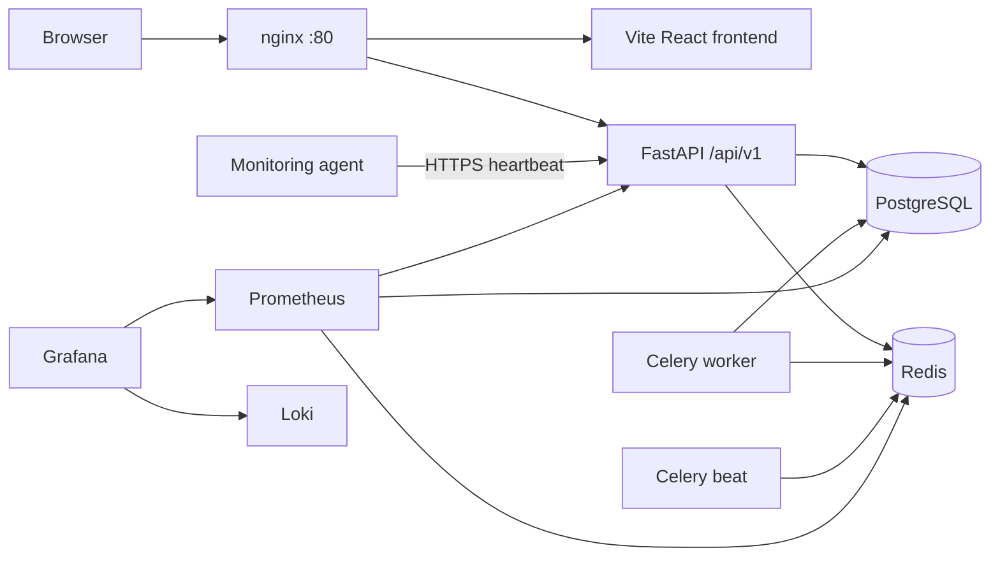
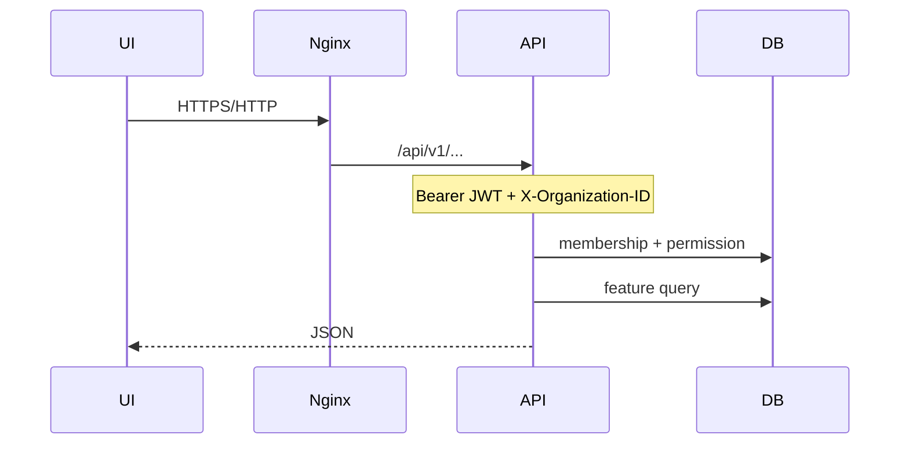

# System architecture

Sandbox is a **modular monolith**: one FastAPI process, one Postgres database, Redis, Celery workers, and a React SPA. Nginx terminates HTTP in Compose and proxies `/api` to the backend and `/` to Vite.



## Trust boundaries

| Boundary | How it is enforced |
|----------|-------------------|
| User ↔ API | JWT Bearer; CORS allowlist |
| User ↔ tenant data | Active `organization_members` row + `X-Organization-ID` + queries scoped by org/project |
| Agent ↔ API | Enrollment token then hashed agent credential on `/api/v1/monitoring/*` (not the user JWT) |
| Scanner ↔ target | Outbound HTTP/DNS/WHOIS/ports from the API or worker network; optional Nmap if installed |
| Audit trail | Append-only `audit_logs` + hash chain (Postgres trigger) |

## Primary runtime flows

### Authenticated UI request



### Scan

```
POST /api/v1/projects/{id}/.../scans/{id}/run
  → scan_service.require_scannable_asset (org asset, status=active)
  → SCAN_RUN_INLINE ? orchestrator in-process : Celery app.jobs.scans
  → asset adapter → plugin loader → plugins
  → findings + scan_plugin_runs
  → risk engine snapshots
  → event_bus (scan.started / completed / failed / plugin_failed)
```

Deep-dive diagrams: [docs/scan-engine.md](../scan-engine.md).

### Domain event

```
feature module
  → event_bus.publish(name, payload, db=..., organization_id=...)
  → persist_audit_event (hash chain)
  → forward_audit_to_siem (no-op if AUDIT_SIEM_SINK=none)
  → notifications.on_domain_event (log only)
```

A failing subscriber is caught; it does not roll back the business commit by itself. Audit persist additionally uses a SAVEPOINT so audit failure does not abort the caller.

## Process inventory (docker-compose.yml)

| Service | Role |
|---------|------|
| `postgres` | System of record (Alembic migrations) |
| `redis` | Celery broker/backend; rate limit / session support as used by the app |
| `backend` | Uvicorn `app.main:app` with reload |
| `celery-worker` | Scans, reports, monitoring reconcile, heartbeat task |
| `celery-beat` | Schedules: example heartbeat 5m; scan schedules 1m; offline agents 1m |
| `frontend` | Vite dev server |
| `nginx` | Public port (default 80) |
| `prometheus`, `grafana`, `loki`, `promtail` | Metrics and logs |
| `postgres-exporter`, `redis-exporter` | Scrape targets |

There is no separate scan-engine service and no message bus besides Redis + the in-process Python event bus.
