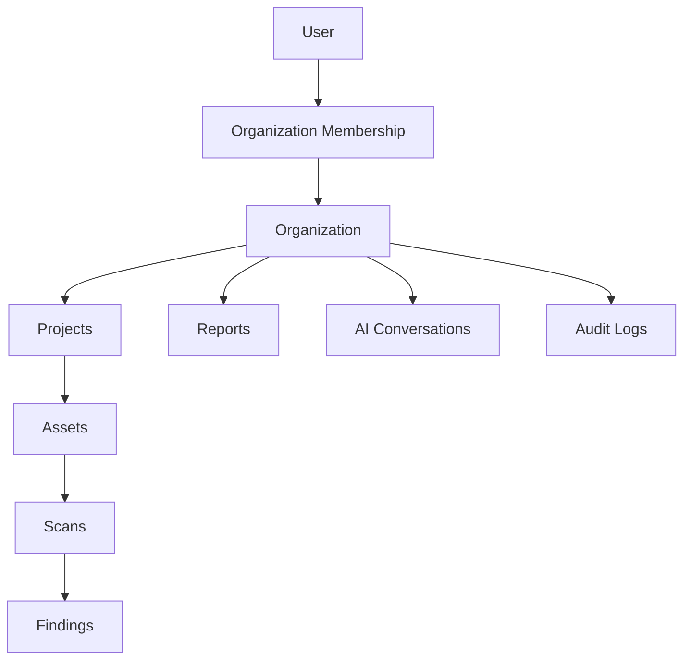
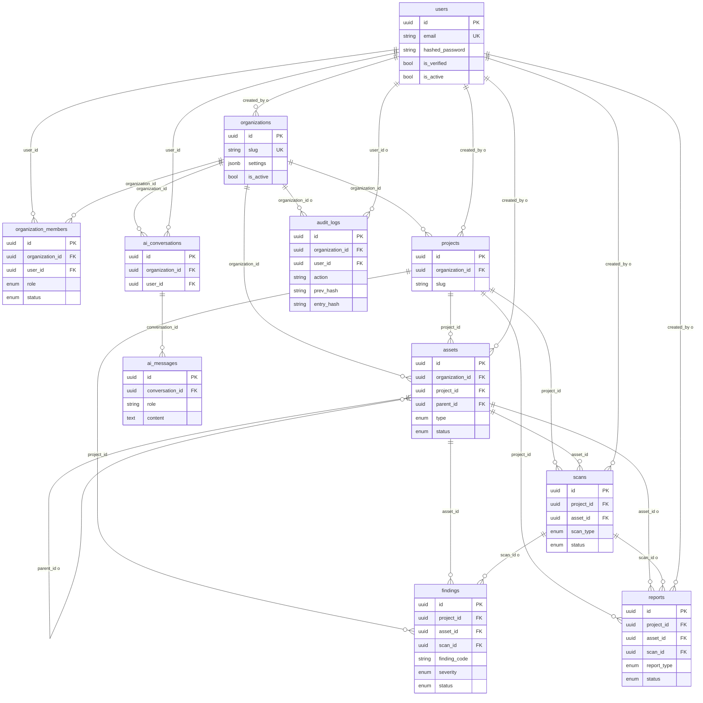

# Entity-relationship diagram

Generated from SQLAlchemy models in `backend/app/**/models.py` (and `organizations/invites.py`, `assets/link_models.py`, `assets/saved_filter_models.py`, `scans/schedule_models.py`). Alembic head: **`045_audit_log_hash_chain`**. **33 tables.** UUID primary keys and `created_at` / `updated_at` mixins are omitted from the pictures.

Notation: `1` / `N` / `0..1`. FK on-delete is listed in the cardinality table (`CASCADE` unless noted).

---

## Logical spine

Product ownership. This is the minimum map. Reports are listed under the organization in the product, but the **table** `reports` belongs to a **project** (`project_id` NOT NULL).

```
User
 │
 ├── Organization Membership     User N : N Organization
 │                               (join: organization_members, unique org+user)
 ▼
Organization
 │
 ├── Projects                    Organization 1 : N Project
 │     │
 │     └── Assets                Project 1 : N Asset
 │            │                  Asset 0..1 : N Asset (parent_id)
 │            └── Scans          Asset 1 : N Scan
 │                   │
 │                   └── Findings  Scan 0..1 : N Finding
 │                                 (scan_id NULL when source = monitoring)
 │
 ├── Reports                     actually Project 1 : N Report
 │                               (optional Asset, optional Scan)
 ├── AI Conversations            Organization 1 : N AIConversation
 │                               (+ User 1 : N)
 └── Audit Logs                  Organization 0..1 : N AuditLog
                                 (organization_id SET NULL on org delete)
```



---

## Diagram — core tenancy and assessment



`o` on a relationship = the FK is nullable.

---

## Diagram — remaining tables

```mermaid
erDiagram
  users ||--o{ refresh_tokens : "user_id"
  refresh_tokens ||--o| refresh_tokens : "replaced_by_id o"
  users ||--o{ password_reset_tokens : "user_id"
  users ||--o{ email_verification_otps : "user_id"

  organizations ||--o{ organization_invites : "organization_id"
  users ||--o{ organization_invites : "invited_by"
  organization_members ||--o{ organization_invites : "membership_id o"

  assets ||--o{ asset_metadata : "asset_id"
  assets ||--o{ asset_tags : "asset_id"
  assets ||--o{ asset_links : "source_asset_id"
  assets ||--o{ asset_links : "target_asset_id"
  organizations ||--o{ asset_links : "organization_id"
  projects ||--o{ asset_saved_filters : "project_id"
  users ||--o{ asset_saved_filters : "user_id"
  organizations ||--o{ asset_saved_filters : "organization_id"

  scans ||--o{ scan_plugin_runs : "scan_id"
  assets ||--o{ scan_plugin_runs : "asset_id"
  assets ||--o{ asset_scan_schedules : "asset_id"
  projects ||--o{ asset_scan_schedules : "project_id"
  scans ||--o{ asset_scan_schedules : "last_scan_id o"

  organizations ||--o| organization_risk : "organization_id"
  organizations ||--o{ organization_risk_history : "organization_id"
  projects ||--o{ project_risk_metrics : "project_id"
  assets ||--o{ asset_risk : "asset_id"
  scans ||--o{ asset_risk : "scan_id o"

  organizations ||--o{ monitoring_agents : "organization_id"
  projects ||--o{ monitoring_agents : "project_id"
  assets ||--o| monitoring_agents : "asset_id"
  users ||--o{ monitoring_agents : "created_by o"
  monitoring_agents ||--o{ monitoring_snapshots : "agent_id"
  assets ||--o{ monitoring_snapshots : "asset_id"
  monitoring_agents ||--o{ monitoring_metrics : "agent_id"
  assets ||--o{ monitoring_metrics : "asset_id"
  monitoring_agents ||--o{ monitoring_alerts : "agent_id"
  organizations ||--o{ monitoring_alerts : "organization_id"
  projects ||--o{ monitoring_alerts : "project_id"
  assets ||--o{ monitoring_alerts : "asset_id"

  organizations ||--o{ ai_usage : "organization_id"
  users ||--o{ ai_usage : "user_id"
```



No FKs: `risk_rules`, `recommendations`, `ai_prompts` (global catalogs).

---

## Cardinalities (from FKs)

Inspected via SQLAlchemy `MetaData.foreign_keys` / unique constraints.

### Identity and tenancy

| Relationship | Cardinality | FK | On delete | Uniqueness |
|--------------|-------------|-----|-----------|------------|
| `users` → `organization_members` | 1 : N | `organization_members.user_id` NOT NULL | CASCADE | unique (`organization_id`, `user_id`) |
| `organizations` → `organization_members` | 1 : N | `organization_members.organization_id` NOT NULL | CASCADE | same |
| `users` → `organizations` | 1 : N | `organizations.created_by` NULL | SET NULL | `organizations.slug` unique globally |
| `organizations` → `organization_invites` | 1 : N | `organization_id` NOT NULL | CASCADE | `token_hash` unique |
| `users` → `organization_invites` | 1 : N | `invited_by` NOT NULL | CASCADE | |
| `organization_members` → `organization_invites` | 1 : 0..N | `membership_id` NULL | SET NULL | |
| `users` → `refresh_tokens` | 1 : N | `user_id` NOT NULL | CASCADE | `token_hash` unique; `replaced_by_id` self-FK SET NULL |
| `users` → `password_reset_tokens` | 1 : N | `user_id` NOT NULL | CASCADE | `token_hash` unique |
| `users` → `email_verification_otps` | 1 : N | `user_id` NOT NULL | CASCADE | |

A user may belong to many organizations; an organization has many members. One membership row per pair.

### Assessment spine

| Relationship | Cardinality | FK | On delete | Uniqueness |
|--------------|-------------|-----|-----------|------------|
| `organizations` → `projects` | 1 : N | `projects.organization_id` NOT NULL | CASCADE | unique (`organization_id`, `slug`) |
| `projects` → `assets` | 1 : N | `assets.project_id` NOT NULL | CASCADE | |
| `organizations` → `assets` | 1 : N | `assets.organization_id` NOT NULL | CASCADE | copied for isolation |
| `assets` → `assets` (parent) | 1 : 0..N | `parent_id` NULL | CASCADE | optional hierarchy |
| `assets` → `scans` | 1 : N | `scans.asset_id` NOT NULL | CASCADE | one scan, one asset |
| `projects` → `scans` | 1 : N | `scans.project_id` NOT NULL | CASCADE | |
| `scans` → `findings` | 1 : 0..N | `findings.scan_id` **NULL** | CASCADE | NULL = monitoring finding |
| `assets` → `findings` | 1 : N | `findings.asset_id` NOT NULL | CASCADE | |
| `projects` → `findings` | 1 : N | `findings.project_id` NOT NULL | CASCADE | |
| `scans` → `scan_plugin_runs` | 1 : N | `scan_id` NOT NULL | CASCADE | |
| `assets` → `scan_plugin_runs` | 1 : N | `asset_id` NOT NULL | CASCADE | |
| `assets` → `asset_scan_schedules` | 1 : N | `asset_id` NOT NULL | CASCADE | unique (`asset_id`, `preset`) |
| `projects` → `asset_scan_schedules` | 1 : N | `project_id` NOT NULL | CASCADE | |
| `scans` → `asset_scan_schedules` | 1 : 0..N | `last_scan_id` NULL | SET NULL | |

### Reports (schema vs product tree)

| Relationship | Cardinality | FK | On delete |
|--------------|-------------|-----|-----------|
| `projects` → `reports` | **1 : N (required)** | `reports.project_id` NOT NULL | CASCADE |
| `assets` → `reports` | 1 : 0..N | `asset_id` NULL | CASCADE |
| `scans` → `reports` | 1 : 0..N | `scan_id` NULL | SET NULL |
| `users` → `reports` | 1 : 0..N | `created_by` NULL | SET NULL |

Org-scoped report APIs join through `projects.organization_id`. There is **no** `reports.organization_id` column.

### AI and audit

| Relationship | Cardinality | FK | On delete |
|--------------|-------------|-----|-----------|
| `organizations` → `ai_conversations` | 1 : N | `organization_id` NOT NULL | CASCADE |
| `users` → `ai_conversations` | 1 : N | `user_id` NOT NULL | CASCADE |
| `ai_conversations` → `ai_messages` | 1 : N | `conversation_id` NOT NULL | CASCADE |
| `organizations` → `ai_usage` | 1 : N | `organization_id` NOT NULL | CASCADE |
| `users` → `ai_usage` | 1 : N | `user_id` NOT NULL | CASCADE |
| `organizations` → `audit_logs` | 1 : 0..N | `organization_id` **NULL** | **SET NULL** |
| `users` → `audit_logs` | 1 : 0..N | `user_id` **NULL** | **SET NULL** |

Audit rows can outlive the org and the actor. Hash chain is per organization in application logic, not a FK.

### Asset satellites

| Relationship | Cardinality | Constraint |
|--------------|-------------|------------|
| `assets` → `asset_metadata` | 1 : N | unique (`asset_id`, `key`); CASCADE |
| `assets` → `asset_tags` | 1 : N | unique (`asset_id`, `tag`); CASCADE |
| `assets` → `asset_links` (source / target) | N : N via join | unique (`source_asset_id`, `target_asset_id`, `link_type`); org FK CASCADE |
| `projects`+`users` → `asset_saved_filters` | N | unique (`project_id`, `user_id`, `name`) |

### Risk snapshots

| Relationship | Cardinality | Notes |
|--------------|-------------|-------|
| `organizations` → `organization_risk` | **1 : 0..1** | `organization_id` unique |
| `organizations` → `organization_risk_history` | 1 : N | time series |
| `projects` → `project_risk_metrics` | 1 : N | snapshot rows; latest used at read time |
| `assets` → `asset_risk` | 1 : N | same; `scan_id` optional SET NULL |
| `risk_rules` / `recommendations` | none | global; unique (`plugin`, `finding_code`) / `code` |

### Monitoring

| Relationship | Cardinality | Constraint |
|--------------|-------------|------------|
| `assets` → `monitoring_agents` | **1 : 0..1** | unique `asset_id` |
| `organizations` / `projects` → `monitoring_agents` | 1 : N | denormalized FKs CASCADE |
| `monitoring_agents` → `monitoring_snapshots` | 1 : N | + `asset_id` CASCADE |
| `monitoring_agents` → `monitoring_metrics` | 1 : N | + `asset_id` CASCADE |
| `monitoring_agents` → `monitoring_alerts` | 1 : N | unique (`asset_id`, `alert_code`) |

Alerts are **not** findings. Some host conditions also insert `findings` with `source=monitoring` and `scan_id` NULL.

---

## Table inventory (33)

| Area | Tables |
|------|--------|
| Identity | `users`, `refresh_tokens`, `password_reset_tokens`, `email_verification_otps` |
| Tenant | `organizations`, `organization_members`, `organization_invites` |
| Work | `projects`, `assets`, `asset_metadata`, `asset_tags`, `asset_links`, `asset_saved_filters`, `asset_scan_schedules` |
| Scan | `scans`, `scan_plugin_runs`, `findings` |
| Reports | `reports` |
| Risk | `risk_rules`, `recommendations`, `asset_risk`, `project_risk_metrics`, `organization_risk`, `organization_risk_history` |
| AI | `ai_conversations`, `ai_messages`, `ai_prompts`, `ai_usage` |
| Audit | `audit_logs` |
| Monitoring | `monitoring_agents`, `monitoring_snapshots`, `monitoring_metrics`, `monitoring_alerts` |

Column-level notes: [tables.md](./tables.md).

## Schema vs product tree

| Product box | Actual owner column |
|-------------|---------------------|
| Reports under Organization | `reports.project_id` required; list-at-org is a query |
| Findings under Scans | `findings.scan_id` optional; monitoring findings have no scan |
| Membership | associative entity, not a column on `users` |
| Audit under Organization | `audit_logs.organization_id` nullable (SET NULL) |

There are no API-key tables and no `notes` table (`assets.notes` is a column).
