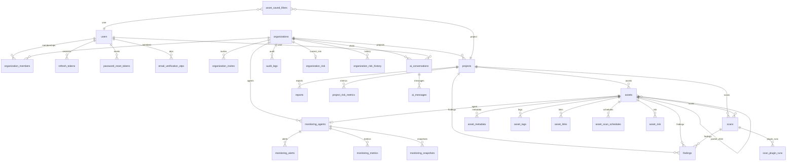

# Entity-relationship diagram (as built)

Simplified: UUID PKs and timestamp mixins omitted. Optional FKs shown with `o`.

Standalone catalogs (not tenant-owned): `risk_rules`, `recommendations`, `ai_prompts`.

`audit_logs.user_id` and `organization_id` are nullable (SET NULL on delete) so history can survive user/org removal.
