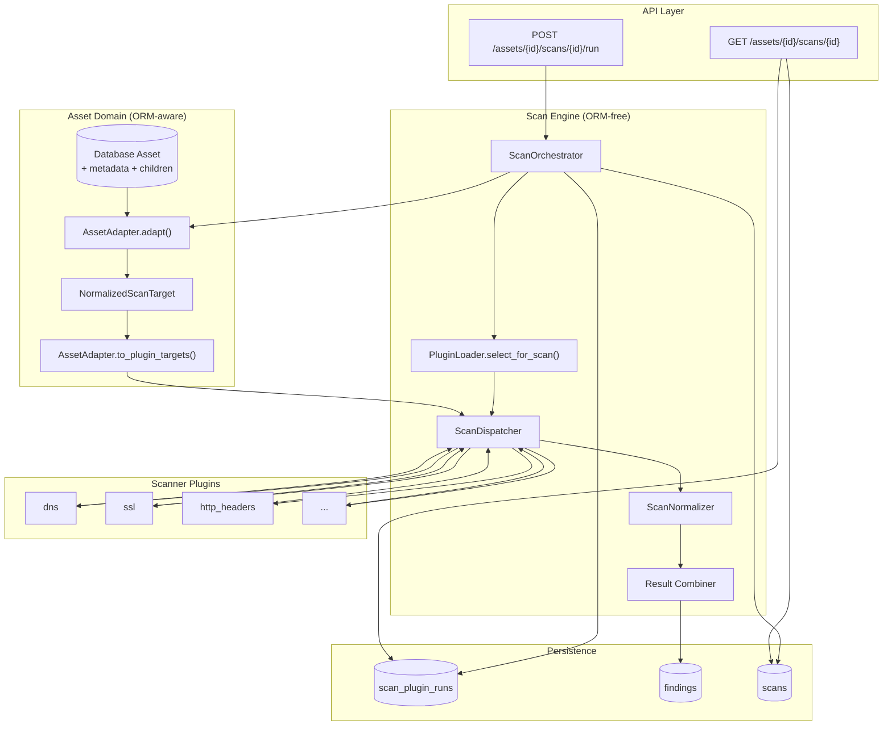
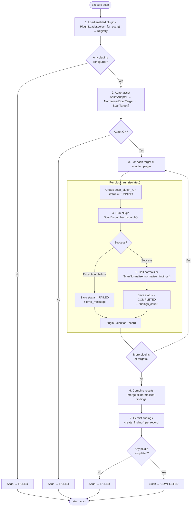
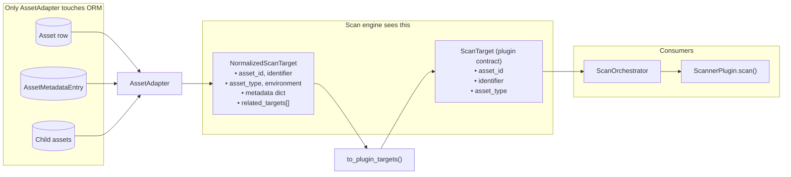
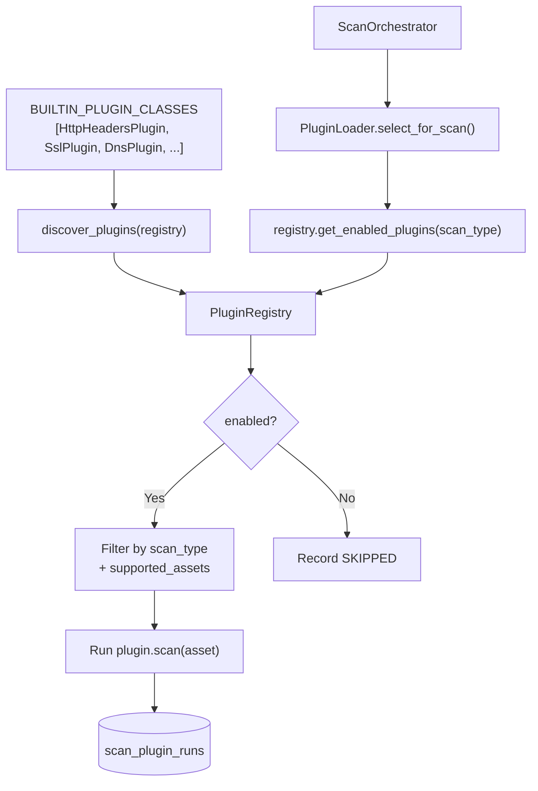
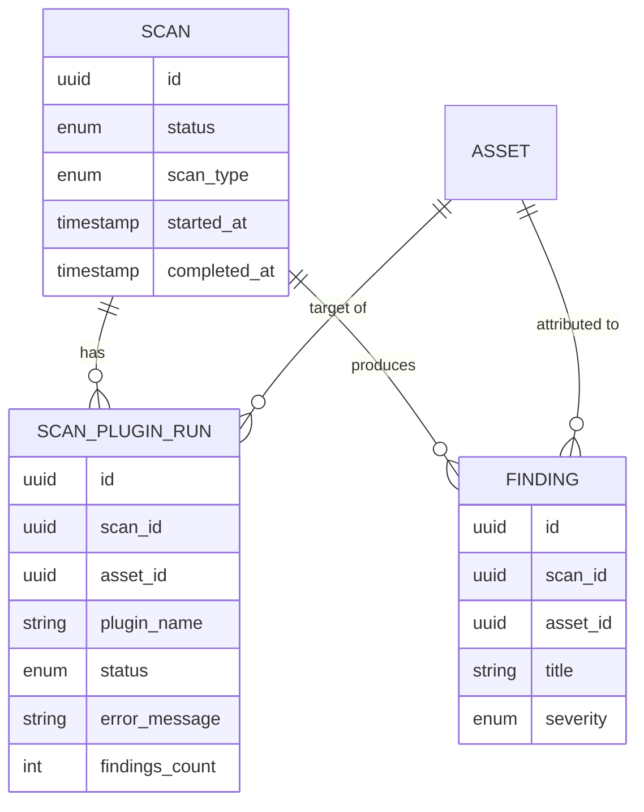
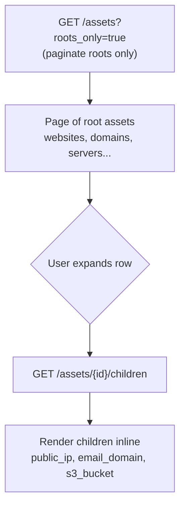

# Scan Engine Architecture

This document describes how assets flow into the scan engine, how the **Scan Orchestrator** coordinates plugins, and how results are persisted. It covers the **Asset Adapter**, plugin execution, per-plugin status tracking, and the asset list tree view.

---

## Overview

Scans are project-scoped and run against **active** assets. The system deliberately separates concerns:

| Layer | Responsibility | Touches ORM? |
|-------|----------------|--------------|
| **Asset Adapter** | Load DB assets, produce normalized scan targets | Yes (only here for scanning) |
| **Scan Orchestrator** | Load plugins, run pipeline, combine results | No |
| **Scanner Plugins** | Execute checks against a `ScanTarget` | No |
| **Scan Service (API)** | HTTP endpoints, audit, transaction commit | Via services only |

**End-to-end path:**

```
POST /projects/{id}/assets/{id}/scans/{id}/run
  → scan_service.run_asset_scan()
  → ScanOrchestrator.execute()
  → AssetAdapter → plugins → normalizer → findings + plugin_runs
```

Apply migration `014` before running scans with plugin status tracking:

```bash
alembic upgrade head
```

---

## 1. High-Level Flow



---

## 2. Scan Orchestrator — Step by Step

The orchestrator owns the full plugin pipeline:

1. **Load enabled plugins** for the scan type
2. **Adapt asset** into normalized scan targets (root + children)
3. **Run each plugin** per target, catching failures in isolation
4. **Save plugin status** to `scan_plugin_runs`
5. **Normalize** raw plugin output via `ScanNormalizer`
6. **Combine** normalized findings across all plugins and targets
7. **Persist findings** and resolve final scan status



**Important:** One plugin failing does **not** stop the others. The scan is marked **COMPLETED** if **any** plugin succeeds (partial success). It is **FAILED** only when every plugin fails or skips, or when asset adaptation fails.

---

## 3. Asset Adapter Boundary

The adapter is the **only** component that loads ORM `Asset` models for scanning. Everything downstream receives plain data objects.



### Type reference

| Type | Location | Purpose |
|------|----------|---------|
| `NormalizedScanTarget` | `app.assets.schemas` | Rich, asset-type-agnostic view for the scan engine |
| `ScanTarget` | `app.plugins.base` | Minimal dataclass passed to every plugin |
| `ScanTargetContext` | `app.assets.schemas` | Alias for `NormalizedScanTarget` (backward compatible) |

### Hierarchy expansion

Parent assets expand into multiple plugin targets:

| Parent type | Child types included in scan |
|-------------|------------------------------|
| `website` | `public_ip` |
| `domain` | `email_domain` |
| `cloud_account` | `s3_bucket` |

---

## 4. Base Plugin Interface

Every scanner plugin inherits the same interface. Plugins receive a normalized `ScanTarget` (the plugin-facing asset contract):

```python
class ScannerPlugin(ABC):
    name: str                  # slug, e.g. "ssl"
    description: str           # human label, e.g. "SSL Scanner"
    version: str
    supported_assets: list[str]
    supported_scan_types: list[str]
    enabled: bool = True

    async def scan(self, asset: ScanTarget) -> ScanResult:
        ...
```

Example implementation:

```python
class SslPlugin(ScannerPlugin):
    name = "ssl"
    description = "SSL Scanner"
    version = "0.1.0"
    supported_assets = ["website", "domain", "api_endpoint", "email_domain"]
    supported_scan_types = [ScanType.FULL.value]

    async def scan(self, asset: ScanTarget) -> ScanResult:
        ...
```

Built-in plugins are registered in one place — no string import paths scattered across the codebase:

```python
# app/plugins/builtin.py
BUILTIN_PLUGIN_CLASSES = [
    HttpHeadersPlugin,
    SslPlugin,
    DnsPlugin,
    WhoisPlugin,
    PortsPlugin,
]
```

---

## 5. Plugin Registry

Instead of hardcoding plugin lists in the orchestrator, the **registry** is the single source of truth:



The orchestrator simply asks:

```
Registry → give me all enabled plugins for this scan type
         → filter by supported_assets per target
```

### Built-in plugins

| Plugin | Description | Scan types | Supported assets |
|--------|-------------|------------|------------------|
| `http_headers` | HTTP Headers Scanner | full, quick | website, api_endpoint |
| `ssl` | SSL Scanner | full | website, domain, api_endpoint, email_domain |
| `dns` | DNS Scanner | full, quick | website, domain, public_ip, email_domain |
| `whois` | WHOIS Scanner | full | domain, email_domain |
| `ports` | Port Scanner | full | public_ip, server, windows_server, docker_host |

Plugins can be disabled via `ScannerPlugin.enabled = False`. Disabled plugins are recorded as **SKIPPED** (once per scan on the primary target).

### Plugin run statuses

| Status | Meaning |
|--------|---------|
| `pending` | Created, not yet started |
| `running` | Plugin execution in progress |
| `completed` | Plugin finished successfully |
| `failed` | Plugin error or returned failure |
| `skipped` | Disabled |

### Adding a new plugin

1. Create `app/plugins/my_scanner/plugin.py` implementing `ScannerPlugin`
2. Add the class to `BUILTIN_PLUGIN_CLASSES` in `app/plugins/builtin.py`
3. No orchestrator changes required — the registry picks it up automatically

---

## 6. Data Written Per Scan Run



**Example:** A **FULL** scan on a **website** with one **public_ip** child runs each enabled plugin against **both** targets. Findings are attributed to the correct `asset_id`. Plugin runs are unique per `(scan_id, asset_id, plugin_name)`.

### API response

`GET /projects/{project_id}/assets/{asset_id}/scans/{scan_id}` and the response from `POST .../run` include `plugin_runs[]` with per-plugin status.

---

## 7. Asset List Tree View

The frontend asset list supports an expandable tree so pagination applies to **root assets only**, avoiding split parent/child pages.



### View modes

| Mode | API | Behavior |
|------|-----|----------|
| **Tree** (default) | `?roots_only=true` | Paginate roots; expand to load children |
| **Flat** | Standard list | All matching assets on one paginated list |

Tree view auto-disables when **searching** or filtering by **child asset types** (`public_ip`, `email_domain`, `s3_bucket`).

### Related API

| Endpoint / param | Purpose |
|------------------|---------|
| `GET /assets?roots_only=true` | Root assets only |
| `GET /assets/{id}/children` | Direct children for expand |
| `GET /assets?parent_id={uuid}` | Alternative children listing |

---

## Key Files

### Asset domain

| File | Role |
|------|------|
| `backend/app/assets/adapter.py` | `AssetAdapter` — DB → normalized targets |
| `backend/app/assets/schemas.py` | `NormalizedScanTarget`, `AssetSummary` |
| `backend/app/assets/metadata.py` | Primary identifier resolution |
| `backend/app/assets/repositories/asset_repository.py` | List, roots_only, children queries |

### Scan engine

| File | Role |
|------|------|
| `backend/app/core/scan_engine/orchestrator.py` | `ScanOrchestrator` — pipeline entry point |
| `backend/app/core/scan_engine/normalizer.py` | Raw findings → normalized dicts |
| `backend/app/core/scan_engine/result_combiner.py` | Combine findings, resolve scan status |
| `backend/app/plugins/base.py` | `ScannerPlugin` interface, `ScanTarget`, `ScanResult` |
| `backend/app/plugins/builtin.py` | `BUILTIN_PLUGIN_CLASSES` — single registration list |
| `backend/app/plugins/registry.py` | `PluginRegistry.get_enabled_plugins()` |
| `backend/app/core/scan_engine/plugin_loader.py` | `PluginLoader.select_for_scan()` |
| `backend/app/core/scan_engine/dispatcher.py` | Invoke async plugins, catch exceptions |

### Scans and plugins

| File | Role |
|------|------|
| `backend/app/scans/services/scan_service.py` | Create, run, get scans |
| `backend/app/scans/models.py` | `Scan`, `ScanPluginRun` |
| `backend/app/scans/repositories/scan_plugin_repository.py` | Plugin run persistence |

### Frontend

| File | Role |
|------|------|
| `frontend/src/features/assets/pages/Assets.jsx` | Tree/flat toggle, expand state |
| `frontend/src/features/assets/components/AssetTable.jsx` | Hierarchical row rendering |
| `frontend/src/features/assets/utils/hierarchy.js` | Tree row builders |

### Migrations

| Revision | Description |
|----------|-------------|
| `014_scan_plugin_runs.py` | `scan_plugin_runs` table + `plugin_run_status` enum |

---

## Design Principles

1. **Plugins never touch the database** — they receive only `ScanTarget`.
2. **Asset Adapter is the scan boundary** — ORM loading and hierarchy resolution live in one place.
3. **Plugin failures are isolated** — one bad plugin does not abort the entire scan.
4. **Status is observable** — every plugin run is recorded for debugging and UI.
5. **New plugins** — add a class + register in `BUILTIN_PLUGIN_CLASSES`; no orchestrator changes.
6. **New asset types** — add metadata/adapter logic; plugins declare `supported_assets`.
7. **Tree list pagination** — roots paginate cleanly; children load on demand.

---

## Related Documentation

- Asset hierarchy rules: `backend/app/assets/enums.py` (`CHILD_PARENT_MAP`)
- Scan permissions: `backend/app/scans/permissions.py` and `app/core/permissions.py`
- Unit tests: `backend/app/core/scan_engine/tests.py`
